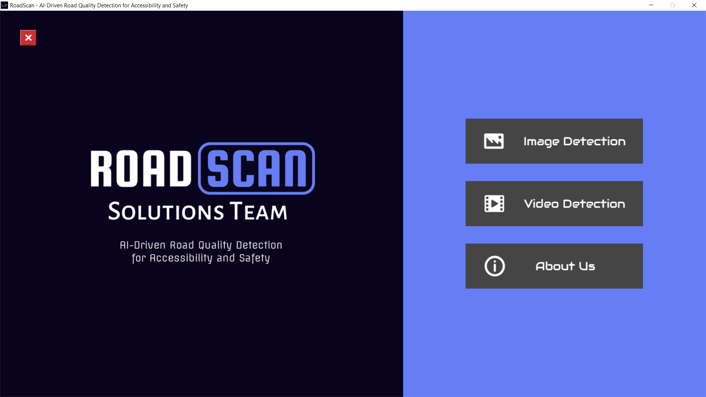
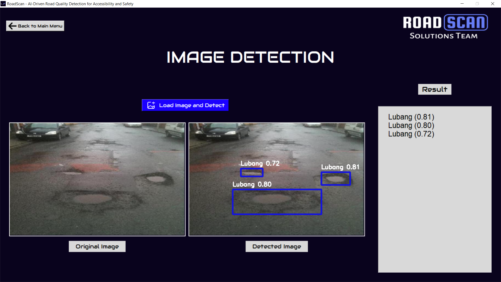
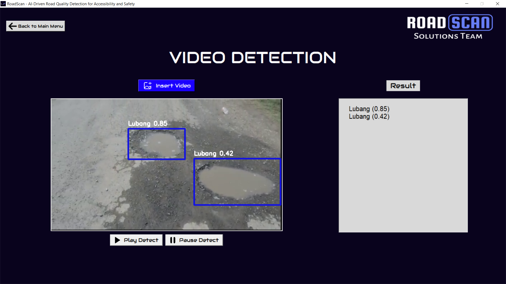
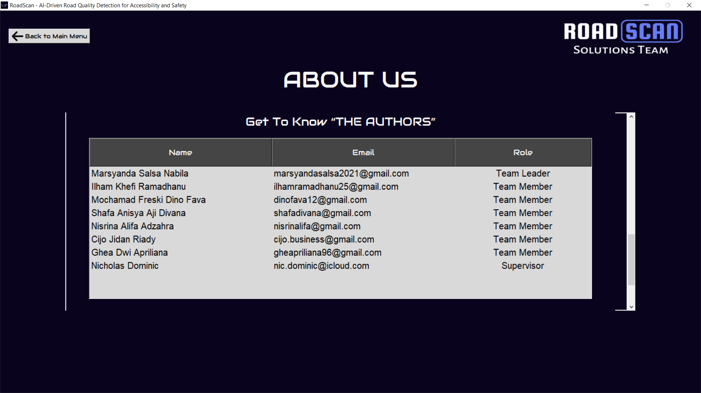

# RoadScan: AI-Driven Road Quality Detection for Accessibility and Safety

## Project Description

**RoadScan** adalah platform berbasis teknologi object detection yang memanfaatkan kecerdasan buatan (AI) untuk mendeteksi berbagai kerusakan infrastruktur jalan seperti lubang, retakan, atau deformasi. Solusi ini memberikan kemampuan otomatisasi, akurasi tinggi, dan efisiensi dalam memantau kondisi jalan untuk perencanaan perbaikan yang lebih strategis.

Penggunaan Computer Vision, khususnya Object Detection, terutama untuk mendeteksi dan mengidentifikasi berbagai kerusakan infrastruktur jalan sangat membantu dalam memantau kondisi jalan secara efisien dan akurat. Teknologi yang digunakan adalah YOLOv8s dari Ultralytics.

YOLO (You Only Look Once) adalah sistem deteksi objek yang terkenal karena kecepatan dan akurasinya. Versi terbaru, YOLOv8s, membawa peningkatan yang signifikan dari versi sebelumnya.

Detail Fitur dan Manfaat:
- **Automatisasi Inspeksi Jalan**<br>
   Sistem berbasis AI ini secara otomatis mampu mendeteksi jenis kerusakan jalan dari gambar atau video, menggantikan inspeksi manual yang memakan waktu dan tenaga.
- **Penghematan Biaya dan Waktu**<br>
   Implementasi sistem ini menghasilkan respons yang lebih cepat dan efisien terhadap kerusakan jalan sehingga mengurangi biaya perbaikan dan durasi inspeksi manual.
- **Pemetaan Kerusakan dan Prioritas Perbaikan**<br>
   Platform ini menghasilkan data untuk memetakan area dengan kerusakan paling parah, sehingga memudahkan penentuan prioritas perbaikan sesuai kebutuhan.
- **Peningkatan Keselamatan dan Kepuasan Pengguna Jalan**<br>
   Dengan deteksi dini kerusakan jalan ini menurunkan risiko kecelakaan akibat jalan rusak dan meningkatkan kepercayaan masyarakat terhadap kualitas infrastruktur.

RoadScan mendukung pencapaian Sustainable Development Goal (SDG) 11: Kota dan Pemukiman yang Berkelanjutan.
- Meningkatkan keselamatan dan mobilitas masyarakat melalui deteksi dini kerusakan jalan.
- Mendorong efisiensi dalam perbaikan jalan, sehingga mendukung kota yang lebih tangguh, aman, dan ramah lingkungan.

## Contributor
| Full Name | Affiliation | Email | LinkedIn | Role |
| --- | --- | --- | --- | --- |
| Marsyanda Salsa Nabila | Startup Campus, AI Track | marsyandasalsa2021@gmail.com  | [link](https://www.linkedin.com/in/marsyandasalsanabila/) | Team Lead |
| Ilham Khefi Ramadhanu | Startup Campus, AI Track | ilhamramadhanu25@gmail.com | [link](https://www.linkedin.com/in/ilham-khefi-ramadhanu) | Team Member |
| Mochamad Freski Dino Fava | Startup Campus, AI Track | dinofava12@gmail.com | [link](https://www.linkedin.com/in/mochamad-freski-dino-fava-4a9162323/) | Team Member |
| Shafa Anisya Aji Divana | Startup Campus, AI Track | shafadivana@gmail.com | [link](https://www.linkedin.com/in/shafadivana/) | Team Member |
| Nisrina Alifa Adzahra | Startup Campus, AI Track | nisrinalifa@gmail.com | [link](https://www.linkedin.com/in/nisrina-alifa-adzahra/) | Team Member |
| Cijo Jidan Riady | Startup Campus, AI Track | cijo.business@gmail.com | [link](https://www.linkedin.com/in/cijo/) | Team Member |
| Ghea Dwi Apriliana | Startup Campus, AI Track | gheapriliana96@gmail.com | [link](https://www.linkedin.com/in/ghea-dwi-apriliana-5623a8193/) | Team Member |
| Nicholas Dominic | Startup Campus, AI Track | nic.dominic@icloud.com | [link](https://linkedin.com/in/nicholas-dominic) | Supervisor |

## Setup
### Prerequisite Packages (Dependencies)
- pandas==2.1.0
- openai==0.28.0
- google-cloud-aiplatform==1.34.0
- google-cloud-bigquery==3.12.0
- tensorflow==2.12.0
- opencv-python==4.6.0
- numpy==1.23.0
- Pillow==7.1.2
- pyyaml==5.3.1
- requests==2.23.0
- seaborn==0.11.0
- scikit-learn==1.3.0
- torch==1.8.0
- torchvision==0.9.0
- tqdm==4.64.0
- ultralytics==8.3.31
- ultralytics-thop==2.0.0
- customtkinter==5.2.0
- matplotlib==3.3.0
- seaborn==0.12.0
- scipy==1.4.1
- contourpy==1.0.1
- cycler==0.10
- fonttools==4.22.0
- kiwisolver==1.0.1
- packaging==20.0
- pyparsing==2.3.1
- python-dateutil==2.7
- pytz==2020.1
- tzdata==2022.1
- charset-normalizer<4,==2
- idna<4,==2.5
- urllib3<3,==1.21.1
- certifi==2017.4.17
- typing-extensions==4.8.0
- MarkupSafe==2.0
- sympy==1.13.1
- mpmath<1.4,==1.1.0
- Python==3.11.2 (latest)
- tkinter==Integrated with Python
- pip==23.0.1 (latest)
- setuptools==67.2.0 (latest)
- wheel==0.38.4 (latest)
- Keras==2.12.0 (latest)

### Environment
**Google Colab**
| | |
| --- | --- |
| CPU | Intel(R) Core(TM) i7-7820HQ CPU @ 2.90GHz   2.90 GHz |
| GPU | NVIDIA Tesla T4 |
| ROM | 256 GB SSD |
| RAM | 15 GB |
| OS | Windows 10 Pro 22H2 |

**Deployment**
| | |
| --- | --- |
| CPU | Intel(R) Core(TM) i7-7820HQ CPU @ 2.90GHz   2.90 GHz |
| GPU | NVIDIA GeForce 940MX |
| ROM | 256 GB SSD |
| RAM | 32 GB |
| OS | Windows 10 Pro 22H2 |

## Dataset
Dataset "Jalan Rusak" dirancang untuk mendeteksi kerusakan jalan menggunakan teknik computer vision. Dataset ini terdiri dari gambar-gambar yang telah dianotasi dengan label yang merepresentasikan berbagai jenis kerusakan jalan. Yaitu berisi kumpulan foto kerusakan jalan yang berjumlah 4.983 data, dengan pembagian sebanyak 4.098 data train, 591 data validation, dan 294 data test yang terbagi menjadi 6 kategori yaitu Lubang, Melintang, Memanjang, Pinggir, Retak Buaya dan Sambungan.

- Link: https://universe.roboflow.com/tugas-xogo7/jalanrusak-zofhk

**Gambar Setiap Kelas**
1. Lubang <br>
   
   
2. Melintang <br>
   
   
3. Memanjang <br>
   
   
4. Pinggir <br>
   

5. Retak Buaya <br>
   
   
6. Sambungan <br>
   


## Results
### Model Performance
Seperti yang tertera di deskripsi project bahwa model yang kami gunakan adalah YOLOv8s. Namun, sebelumnya kami telah mencoba terlebih dahulu membandingkan performa antara YOLOv8n dan YOLOv8s (mAP dan running time). Berdasarkan perbandingan dan ekplorasi yang telah dilakukan, kami memilih untuk menggunakan model YOLOv8s sebagai model dengan performa terbaik.

Model-model yang dijalankan dilakukan preprocessing dengan melakukan resize image (imgsz) sebesar 640 untuk menyamaratakan size input image. Selebihnya data sudah cukup baik sehingga tidak dilakukan preprocessing lainnya.

#### 1. Metrics
Berikut adalah tuning terbaik yang kami pilih dan gunakan untuk modifikasi arsitektur model.

| model | epoch | learning_rate | batch_size | optimizer | val_precision | val_recall | mAP50 | mAP 50-95 |
| --- | --- | --- | --- | --- | --- | --- | --- | --- |
| YOLOv8s | 50 | 0.001 | 32 | AdamW | 0.902 | 0.908 | 0.947 | 0.707 |
| YOLOv8s | 50 | 0.001 | 16 | AdamW | 0.898 | 0.902 | 0.943 | 0.698 |
| YOLOv8n | 50 | 0.001 | 32 | AdamW | 0.908 | 0.889 | 0.939 | 0.688 |
| YOLOv8n | 50 | 0.001 | 16 | AdamW | 0.904 | 0.888 | 0.944 | 0.678 |

Model dengan hyperparameter terbaik yang kami pilih adalah:
| model | epoch | learning_rate | batch_size | optimizer | val_precision | val_recall | mAP50 | mAP 50-95 |
| --- | --- | --- | --- | --- | --- | --- | --- | --- |
| YOLOv8s | 50 | 0.001 | 32 | AdamW | 0.902 | 0.908 | 0.947 | 0.707 |

Alasan kami memilih model tersebut sebagai model terbaik yang kami terapkan karena tingkat keakuratan yang didapatkan cukup tinggi dan cukup optimal.

#### 2. Training/Validation Curve

##### Training Curve: 
- Precision Curve:


- Recall Curve:


- PR Curve:


- F1 Curve:


##### Validation Curve: 
- Precision Curve:


- Recall Curve:


- PR Curve:


- F1 Curve:


##### Train / Val Loss:

Dari grafik Training/Validation di atas dapat disimpulkan bahwa:
- Model berlatih dengan baik: Loss (box, cls, dfl) untuk data training dan validation menurun secara konsisten seiring bertambahnya epoch, menunjukkan proses pembelajaran yang efektif.

- Tidak ada overfitting: Loss validation mengikuti tren loss training dengan baik, dan metrik performa (precision, recall, mAP50, mAP50-95) pada data validation terus meningkat. Hal ini menunjukkan model tidak overfitting pada data training.

- Performa model bagus: Metrik evaluasi seperti precision, recall, mAP50, dan mAP50-95 menunjukkan angka yang relatif tinggi dan stabil, menandakan performa model yang baik dalam mendeteksi objek.

#### 3. Confusion Matrix
- Confusion Matrix <br>

- Confusion Matrix Normalized <br>


Dari Confusion Matrix di atas, disimpulkan terlihat bahwa sebagian besar kelas sudah mencapai nilai diagonal 1.00 dan hampir seluruhnya dideteksi dengan benar, mengindikasikan bahwa model dapat mengklasifikasikan objek-objek tersebut dengan sangat baik.

### Testing

1. 
2. 
3. 
4. 
5. 
6. 
7. 
8. 
9. 
10. 

Berdasarkan hasil testing diatas menunjukkan bahwa performa model sudah sangat baik dalam mendeteksi suatu objek berdasarkan label nya dengan benar. dari 10 sample tersebut dinyatakan bahwa model sudah mampu untuk diterapkan sebagai pendeteksian kualitas infrastruktur jalan dengan baik.

### Deployment (Optional)

Anda dapat mengunduh aplikasi kami melalui link berikut:
[](https://github.com/RoadScanSolutionsTeam/RoadScan/releases/tag/v1.0)
<br><br>
Aplikasi ini dikembangkan dengan menggunakan library <b>Tkinter</b>, sebuah library Python populer untuk menciptakan antarmuka pengguna grafis (GUI) yang interaktif dan mudah digunakan. Dengan desain yang user-friendly, aplikasi ini dirancang untuk memberikan pengalaman pengguna yang intuitif dan nyaman. Fitur utama aplikasi ini adalah kemampuannya untuk mendeteksi dan mengidentifikasi kerusakan jalan secara akurat, berkat penggunaan model <b>YOLOv8</b> yang telah dikonfigurasi khusus untuk tugas deteksi kerusakan jalan. Proses deteksi dilakukan berdasarkan input berupa <b>file gambar</b> maupun <b>file video</b>, sehingga memungkinkan pengguna untuk menganalisis berbagai jenis data secara fleksibel.<br><br>
Keunggulan lain dari aplikasi ini adalah adanya fitur <b>Pause Detection</b> dan <b>Start Detection</b>, yang memberikan kontrol penuh kepada pengguna dalam proses identifikasi. Dengan fitur ini, pengguna dapat menghentikan atau melanjutkan deteksi kapan saja, menjadikan analisis kerusakan jalan lebih efisien dan optimal.<br><br>
Dengan kombinasi teknologi terkini dan antarmuka yang sederhana, aplikasi ini menjadi solusi andal untuk membantu mendeteksi dan memetakan kerusakan jalan, membuka peluang untuk pengelolaan infrastruktur yang lebih baik.
<br><br>
<b>PREVIEW</b>
1. **Main Menu**  
   

2. **Image Detection**  
   

3. **Video Detection**  
   

4. **About**  
   


## Supporting Documents
### Presentation Deck
- Link: https://drive.google.com/drive/folders/1POz2q_welpUzuJ7k8rlSRnLryN0kaFJL?usp=sharing


### Business Model Canvas


- **Problem Statement**
   <br>Tingginya tingkat kerusakan jalan berlubang di berbagai wilayah Indonesia menyebabkan peningkatan risiko kecelakaan lalu lintas dan menghambat
   kelancaran mobilitas masyarakat. Kerusakan jalan berlubang mengakibatkan biaya perawatan kendaraan meningkat, waktu tempuh menjadi lebih lama, dan potensi
   terjadinya kecelakaan yang dapat menimbulkan korban jiwa dan kerugian materi.
  
- **Mission Statement**
   <br>Menyediakan platform berbasis AI yang mampu mendeteksi, menganalisis, dan memonitor kondisi jalan secara otomatis.
  
- **Key Partners**
  <br> Jaringan pemasok dan mitra pendukung model/ide bisnis
  1. Pemerintah Lokal dan Pusat
  2. Kontraktor
  3. Penyedia Cloud
  4. Investor
  5. Penyedia Data
  6. Tech Companies
  7. Payment Gateway

- **Key Activities**
  1. Technology R&D
  2. Production & Maintenance
  3. Pengumpulan Data Jalan
  4. Data Analytics
  5. Sales & Marketing

- **Key Resources**
  1. Karyawan
  2. Database
  3. Teknologi (AI Model, Cloud, etc.)
  4. Payment Gateway

- **Value Propositions**
  1. Identifikasi cepat dan akurat
  2. Peningkatan keselamatan pengguna jalan
  3. Penghematan Biaya Perawatan Jalan dengan identifikasi dan penanganan kerusakan jalan lebih awal

- **Stakeholder / Customer Relationship**
  1. Customer Service
  2. Community Forum
  3. Social Media and Email Support
  4. Referral Program (pemberian hadiah kepada pengguna yang berhasil mengajak teman untuk mendaftar dan berbelanja)
 
- **Channels**
  1. Word of Mouth
  2. Online Ads
  3. Social Media

- **Stakeholder / Customer Relationship**
  1. Pemerintah Lokal dan Pusat (pengelola infrastruktur)
  2. Perusahaan Konstruksi atau perbaikan jalan
  3. Perusahaan Logistik dan Transportasi
  4. Organisasi non-pemerintah yang peduli infrastruktur
  5. Komunitas lokal atau individu yang ingin berkontribusi
 
- **Cost Structure**
  
  CAPITAL EXPENDITURE
  1. Biaya Pengumpulan Data
  2. Research and Development

  OPERATIONAL EXPENDITURE
  1. Production and Maintenance
  2. Marketing
  3. Deployment
 
- **Revenue Streams**
  1. Subscription Model
  2. Data Licensing
  3. Integrasi premium

### Short Video
- Link: https://...

## References
- Link: https://www.aideeplearningml.com/how-to-train-yolov8-object-detection-on-custom-fruit-vegetabdataset/
- Link: https://youtube.com/playlist?list=PL8q4s70ndvwf3mFNaW8BLNrrItNl6PlA2&si=V-woIN2RLIjSuKMO
- Link: https://...

## Additional Comments
Provide your team's additional comments or final remarks for this project. For example,
1. ...
2. ...
3. ...

## How to Cite
If you find this project useful, we'd grateful if you cite this repository:
```
@article{
...
}
```

## License
For academic and non-commercial use only.

## Acknowledgement
This project entitled <b>"RoadScan"</b> is supported and funded by Startup Campus Indonesia and Indonesian Ministry of Education and Culture through the "**Kampus Merdeka: Magang dan Studi Independen Bersertifikasi (MSIB)**" program.
